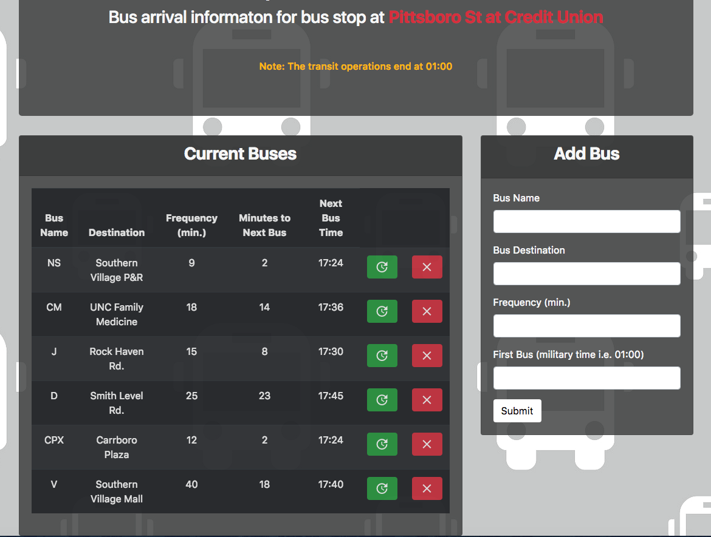
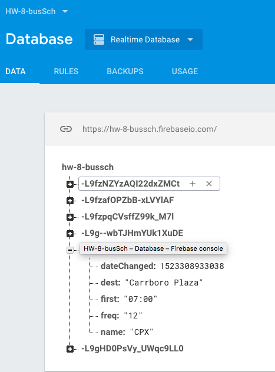

# BusSchedule

## Summary 

This app calculates arrival times and bus stop wait times for Chapel Hill Transit busses whose route constitudes the "Pittsboro St at Credit Union" bus stop. The app obtains input from user to set up new bus routes. The user is requred to input name, destination, frequency (minutes) and first Bus time (in millitary time such as 03:00 in 24 hour format).

The app provides user with a list of name of the busses, destinations, frequencies (minutes), time to next bus (minutes) and arrival time for the next bus.  The user is also given the option to remove any of the bus routes or update the arrival time information via two buttons on the right hand side of the table.

The busses are operational until 01:00 of next day so any queries after this time yields "No bus after 1am" message and the time for first bus in the morning.



---

## Specifications and design

The app makes use of google Firebase database and all the bus information is saved in a firebase database online. Upon new entry this database is updated via ```database.ref().on('child-added',function{})``` callback function. Each bus is assigned a unique key which holds the information for the busses in the database. These are utilized in assigneing unique data attributes to **remove** and **update** buttons. In addition each bus entry in the database contains a ```dateChanged``` attribute. This attribute is used to triger updates on individual busses when the **update** button is pressed. this is done by a listener and callback function setup as ```database.ref().on('value',function{})```. 



The corresponding table columns are assigned special class names to make them easily accessible via a JQuery call such as the following

```javascript
$(this).closest("tr").children(".minsTo").text(minsTo);
```
In addition, moment.Js is utilized to calculate time differences between start of busses and the current time in minutes. This could fail if the bus query is carried out after midnight, as the time difference at this time is negative. Hence, addiditonal ```if {} else {} ``` statements are utilized to account for this. 